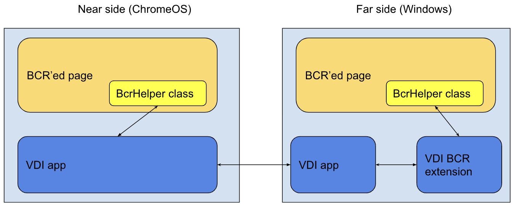

# Enhanced browser content redirection / BCR++

## Introduction

Certain web apps (e.g. video streaming or video conferencing) produce a poor user experience when used via virtual desktop infrastructure (VDI). Therefore, VDI providers have built “browser content redirection” (BCR) technology that offloads these use cases back from the remote machine (“far”) back to the client endpoint (“near”). BCR only renders the actual web contents frame of the browser on the client endpoint to make the whole experience seamless and unbeknown to the end user. It does so by overlaying a frame (`<webview>` for Chrome apps, [`<controlledframe>`](https://github.com/WICG/controlled-frame) for IWAs) on the near side and maintaining its position and size to be where the browser’s viewport on the far side would be.

For most use cases (e.g. watching a video on Youtube), it is enough to offload rendering to the client endpoint. For some use cases (e.g. video conferencing), we have additional requirements to make the experience seamless to the user. For example:
* Exchanging authentication/authorization tokens and call metadata to prevent another authentication on the client endpoint.
* Ability to still interact with content on the remote side, e.g. sharing a desktop/window/tab or file from there.

We therefore propose to have an enhanced version of BCR (BCR++), which offers the following capabilities: Allow the web app to…
be running on near and far side in parallel
* detect whether BCR is in play and whether it is on the near or far side
* exchange messages between near and far side
* temporarily hide the near side to still allow interactions with the far side

URLs on which the enhanced version of BCR should be applied to could be configured in a separate list via policy.

## Proposed design
As a high-level design, the VDI provider would do regular BCR for the detected URL, but would allow the URL to be loaded on both sides and inject a script that provides a helper class into both. The web app then uses the helper class to accomplish said requirements from above.



The interface of the BcrHelper can be seen [here](index.d.ts).

### VDI provider

#### BcrHelper class
The `BcrHelper` class would then use [`chrome.runtime.connect()`](https://developer.chrome.com/docs/extensions/reference/runtime/#method-connect) / [`sendMessage()`](https://developer.chrome.com/docs/extensions/reference/runtime/#method-sendMessage) to communicate to the VDI provider’s BCR extension on the far side or the VDI client app on the near side. The BCR extension and client app already have a virtual channel to exchange BCR related information, which could also be used to transfer these additional requests or messages.

#### Page load
Just as with regular BCR, the VDI provider’s BCR extension on the far side would detect navigation to a URL that should be BCR’ed and initiates its rendering on the near side with an overlayed frame, whose position and size are maintained.
If the URL is also on the list for enhanced BCR, unlike regular BCR, the page on the far side would still be rendered without additional interference (e.g. blocking the page load or clearing its DOM).
Using the helper class, the far side page would detect on its own, what contents it should render and whether it should e.g. claim resources like audio/video devices.

#### Inject helper script
In order to make the `BcrHelper` class available to the web app, we need to define it before the web app’s own scripts are running.
We do so by loading a content script, which injects a script that defines the BCR helper class. The additional script is needed since content scripts run in their own isolated context, while the injected script runs in the web app’s context.


```javascript
// content_script.js

var scriptElement = document.createElement ("script");
var url = chrome.runtime.getURL ("injected_script.js");
scriptElement.src = url;
// document.head is null when `run_at: document_start` is used
document.documentElement.appendChild (scriptElement);
```

The content script is loaded with `"run_at": "document_start"`` to ensure both the content and injected scripts are run before the web app’s own scripts are run.

##### Far side
On the far side, the BCR extension would define the content script for all websites (https://* and http://) in its manifest:

```json
// manifest.json

{
  ...
  "content_scripts": [
    {
      "matches": ["https://*", "http://*"],
      "run_at": "document_start",
      "js": ["content_script.js"]
    }
  ],
  ...
}
```

Or use the new MV3 [*chrome.scripting.registerContentScripts()`](https://developer.chrome.com/docs/extensions/reference/scripting/#method-registerContentScripts) API to just inject the script into BCR’able URLs (in which case we would not need `BcrSide.NONE`).

```javascript
// service_worker.js or background.js

await chrome.scripting.registerContentScripts({
  matches: [/* list of URLs for enhanced BCR from policy/config here*/],
  js: ['content_script.js'],
  run_at: "document_start",
});
```
##### Near side
On the near side, the VDI client app would use the overlay's `addContentScripts()`` method to achieve the same.

```javascript
// desktop.js

const bcrUrl = 'https://bcr-url.com';
const webview = document.createElement('webview');
webview.addContentScripts([{
    name: 'bcr-helper',
    matches: [bcrUrl],
    js: { files: ['content_script.js'] },
    run_at: 'document_start'
}]);
webview.src = bcrUrl;
document.body.appendChild(webview);
```

### Usage

Sites integrating with enhanced BCR can use this helper method to check if enanched BCR is available and on which side they are running.

```javascript
function isEnhancedBcrAvailable() {
    return (typeof BcrHelper === 'function');
}
```

Since the VDI providers' content script will add the definition of the `BcrHelper` class at `document_start`, it will be available before any of the site's own code will run.

#### Sample code
```javascript
const bcrHelper = new BcrHelper();
bcrHelper.addOnMessageListener((message) => {console.log("message from other side", ab2str(message));});
const side = await bcrHelper.getSide();
await bcrHelper.sendMessageToOtherSide(str2ab(`Hello from the ${BcrSide[side]} side`));
```
